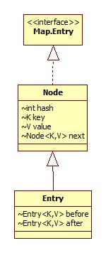

LinkedHashMap是HashMap的子类，内部使用双链表进行顺序的维护，内部类Entry为HashMap的Node的子类，类图:



# 构造器

三参数构造器:

```java
public LinkedHashMap(int initialCapacity, float loadFactor, boolean accessOrder) {
    super(initialCapacity, loadFactor);
    this.accessOrder = accessOrder;
}
```

如果accessOrder为true，那么表示将顺序记录为访问顺序，否则为插入顺序，默认为false。而正是这一参数并对removeEldestEntry方法进行覆盖便可以快速实现一个简单的LRU缓存。

# put

put操作其实和父类HashMap采用相同的实现，在HashMap部分也提到了afterNodeAccess和afterNodeInsertion方法其实是空实现，而在LinkedHashMap中对其进行了实现，Linked的特性也是在这里进行了体现。

## afterNodeAccess

顾名思义，此方法应该在一次访问之后被调用，那么什么算是一次访问呢?LInkedHashMap对此做出了定义:

- put
- putIfAbsent
- get
- getOrDefault
- compute
- computeIfAbsent
- ​