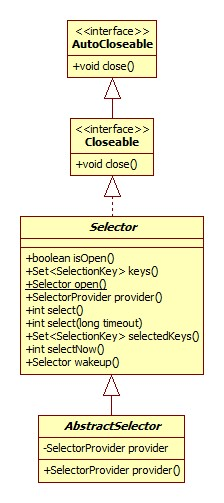
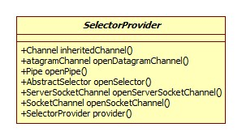

服务器代码以nio包下的Server为例。

# Selector

官方的定义是SelectableChannel的多路复用器。类图:



AbstractSelector存在的意义是允许不同的服务提供者以平台相关的方式进行创建，比如在Windows平台上，完整的继承体系是这样:


## 创建

我们通常用下列方式进行创建:

```java
 Selector selector = Selector.open();
```

源码:

```java
public static Selector open() throws IOException {
    return SelectorProvider.provider().openSelector();
}
```

SelectorProvider定义了Selector的提供者。类图:



在Windows上的完整继承体系:


SelectorProvider的查找顺序如下:

- VM属性java.nio.channels.spi.SelectorProvider。

- 加载 系统服务，即jar包/META-INF/services文件夹下，这个默认是没有的。

- 默认方式:

  ```java
  provider = sun.nio.ch.DefaultSelectorProvider.create();
  ```

  在Windows上的实现便是:

  ```java
  public static SelectorProvider create() {
    return new WindowsSelectorProvider();
  }
  ```

  Linux实现:

  ```java
  public static SelectorProvider create() {
    String osname = AccessController
        .doPrivileged(new GetPropertyAction("os.name"));
    if (osname.equals("SunOS"))
        return createProvider("sun.nio.ch.DevPollSelectorProvider");
    if (osname.equals("Linux"))
        return createProvider("sun.nio.ch.EPollSelectorProvider");
    return new sun.nio.ch.PollSelectorProvider();
  }
  ```

  下面我们以Linux基准。

EPollSelectorProvider.openSelector:

```java
public AbstractSelector openSelector() throws IOException {
    return new EPollSelectorImpl(this);
}
```

## select

返回就绪的通道数，阻塞方法。SelectorImpl.select调用了select(0)方法:

```java
public int select(long timeout) {
    return lockAndDoSelect((timeout == 0) ? -1 : timeout);
}
```

# 通道

FileChannel我们已经见识过了，下面再来见识一下网络通道。两者的继承体系有相同的部分，从AbstractInterruptibleChannel开始分家，我们的类图就从AbstractInterruptibleChannel开始。


对于通道部分，仍以Windows作为参考，因为这样便于与Socket的底层实现进行对比。

## open

以ServerSocketChannel为例:

```java
public static ServerSocketChannel open() throws IOException {
    return SelectorProvider.provider().openServerSocketChannel();
}
```

实际上构造了一个	ServerSocketChannelImpl对象，构造方法:

```java
ServerSocketChannelImpl(SelectorProvider sp) {
    super(sp);
    this.fd =  Net.serverSocket(true);
    this.fdVal = IOUtil.fdVal(fd);
    this.state = ST_INUSE;
}
```

Net.serverSocket:

```java
static FileDescriptor serverSocket(boolean stream) {
    return IOUtil.newFD(socket0(isIPv6Available(), stream, true));
}
```

可见，此处其实创建了一个与之关联的ServerSocket对象。socket0实现位于Net.c中，同样是对Windows API socket的调用。IOUtil.newFD负责文件描述符的创建，并将其与socket0返回的地址相关联。

## bind

ServerSocketChannelImpl.bind简略版源码:

```java
@Override
public ServerSocketChannel bind(SocketAddress local, int backlog){
    synchronized (lock) {
        Net.bind(fd, isa.getAddress(), isa.getPort());
        Net.listen(fd, backlog < 1 ? 50 : backlog);
        synchronized (stateLock) {
            localAddress = Net.localAddress(fd);
        }
    }
    return this;
}
```

和Socket一样，同样是分为bind和listen两个步骤，分别对应Net的native方法bind0和listen。bind在底层实现其实是 两个操作: bind和设置端口占用的排他性。bind即Windows函数bind，位于jdk\src\windows\native\java\net\net_util_md.c:

```c
JNIEXPORT int JNICALL
NET_Bind(int s, struct sockaddr *him, int len) {
    int rv;
    rv = bind(s, him, len);
    if (rv == SOCKET_ERROR) {
       //...
    }
    return rv;
}
```

排他性设置由net_util_md.c的NET_SetSockOpt函数实现，简略版源码:

```c
JNIEXPORT int JNICALL
NET_SetSockOpt(int s, int level, int optname, const void *optval,int optlen){
    int rv;
    int parg;
    int plen = sizeof(parg);
    rv = setsockopt(s, level, optname, optval, optlen);
    if (rv == SOCKET_ERROR) {
        //...
    }
    return rv;
}
```

其实和Socket都是一套API.

## configureBlocking

由ServerSocketChannelImpl.implConfigureBlocking实现:

```java
protected void implConfigureBlocking(boolean block) throws IOException {
    IOUtil.configureBlocking(fd, block);
}
```

底层实现便是Windows的ioctlsocket函数，ServerSocket中，被用以实现带超时参数的accept，并未被用于实现非阻塞IO。

## selector注册

AbstractSelectableChannel.register简略版源码:

```java
public final SelectionKey register(Selector sel, int ops,Object att) {
    synchronized (regLock) {
        SelectionKey k = findKey(sel);
        if (k != null) {
            k.interestOps(ops);
            k.attach(att);
        }
        if (k == null) {
            // New registration
            synchronized (keyLock) {
                if (!isOpen())
                    throw new ClosedChannelException();
                k = ((AbstractSelector)sel).register(this, ops, att);
                //加入数组
                addKey(k);
            }
        }
        return k;
    }
}
```

方法将首先检查当前通道是否已经向给定的Selector注册过了 ，AbstractSelectableChannel内部维护有一个SelectionKey数组，findKey方法便是遍历此数组逐一比较其Selector的过程。

SelectionKey的类图如下:


注意，SelectionKey使用AtomicReferenceFieldUpdater进行原子更新attachment。

## 读

从类图中可以看出，只有SocketChannel才具有读写功能，ServerSocketChannel并不具备，这和Socket和ServerSocket的关系是一样的。

源码实现与FileChannle大体类似，但是有两点值得注意:

- 线程安全性，读的核心代码全部位于以下线程同步块中:

  ```java
  synchronized (readLock) {
  	//code...
  }
  ```

  而写代码为writeLock，这也就验证了Channel线程安全的定义，同时说明**SocketChannel支持写和读之间的并行，但不能写与写、读与读之间并行**，这一特性其实是与TCP/IP协议相关的，所以，很容易可以推测FileChannel仅支持单线程读写，FileChannelImpl.read部分源码:

  ```java
  synchronized(positionLock) {//code...}
  ```

- FileChannel-关闭一节也提到了，其实**在非阻塞(NIO)模型下，仍会出现读写操作被阻塞的情况**，那非阻塞IO到底指的是什么呢?

  ​

http://www.cnblogs.com/xiehongfeng100/p/4619451.html

http://www.cnblogs.com/promise6522/archive/2012/03/03/2377935.html

http://www.cnblogs.com/Solstice/archive/2011/05/04/2036983.html

http://blog.csdn.net/Solstice/article/category/642322


