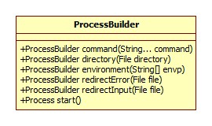

# 命令执行

我们以以下代码为例:

```java
Runtime runtime = Runtime.getRuntime();
String cmd = "ls -l";
Process process = runtime.exec(cmd);
```

实际调用了下面的exec方法:

```java
public Process exec(String command, String[] envp, File dir) {
    StringTokenizer st = new StringTokenizer(command);
    String[] cmdarray = new String[st.countTokens()];
    for (int i = 0; st.hasMoreTokens(); i++)
        cmdarray[i] = st.nextToken();
    return exec(cmdarray, envp, dir);
}
```

第二个参数为环境变量数组，其格式为key=value，第三个参数为命令的执行路径，如果为null，那么便为当前Java进程的工作路径，即user.dir。

StringTokenizer默认以空格、换行符、制表符，换页符(\f)为分隔单位，所以这里将命令`ls -l`分割为了ls和-l两部分。

```java
public Process exec(String[] cmdarray, String[] envp, File dir) {
    return new ProcessBuilder(cmdarray)
        .environment(envp)
        .directory(dir)
        .start();
}
```

其实是用ProcessBuilder实现，此类在JDK1.5时加入。

# ProcessBuilder



## start

start方法简略版源码:

```java
 public Process start() throws IOException {
    String[] cmdarray = command.toArray(new String[command.size()]);
    cmdarray = cmdarray.clone();
    String dir = directory == null ? null : directory.toString();
    return ProcessImpl.start(cmdarray,
                             environment,
                             dir,
                             redirects,
                             redirectErrorStream);
}
```

## Redirect

redirects是一个ProcessBuilder内部的Redirect数组，Redirect为ProcessBuilder的嵌套类，定义了系统的进程的输入或输出:


且redirects数组的大小必定为3，分别代表输入、输出和错误，此数组是lazy-init的，只有当调用其redirects()方法获取整个数组或要设置重定向时才会进行初始化，redirects()源码:

```java
private Redirect[] redirects() {
    if (redirects == null)
        redirects = new Redirect[] {Redirect.PIPE, Redirect.PIPE, Redirect.PIPE};
    return redirects;
}
```

可以看到，默认都是管道类型，这其实很容易理解，每个命令的执行都会导致一个系统进程的创建，我们从进程获得输出，输入必定要通过管道的方式。

## 重定向

其实共有三组方法:


没有参数的表示获取。

### 获取

我们以redirectError为例:

```java
public Redirect redirectError() {
    return (redirects == null) ? Redirect.PIPE : redirects[2];
}
```

### 设置

以redirectInput为例:

```java
public ProcessBuilder redirectInput(File file) {
    //对redirects数组赋值
    return redirectInput(Redirect.from(file));
}
```

from方法其实是对File的包装:

```java
public static Redirect from(final File file) {
    return new Redirect() {
            public Type type() { return Type.READ; }
            public File file() { return file; }
            public String toString() {
                return "redirect to read from file \"" + file + "\"";
            }
        };
}
```

## 输出整合

下面两个方法分别对redirectErrorStream属性进行读取和设置:


如果被设置为true，那么错误输出将会被merge到标准输出。

## 继承 

即Redirect.Type.INHERIT类型。那什么是继承呢?其实就是将启动的进程的输入或输出或错误输出设置为当前Java虚拟机的输入、输出与错误输出。

inheritIO方法源码:

```java
public ProcessBuilder inheritIO() {
    Arrays.fill(redirects(), Redirect.INHERIT);
    return this;
}
```

其实相当于这样:

```java
pb.redirectInput(Redirect.INHERIT).redirectOutput(Redirect.INHERIT).redirectError(Redirect.INHERIT);
```

# Process

代表系统的一个进程。


## start

ProcessImpl在不同的系统上有不同的实现，我们以Linux为准，所做的是将命令、参数以及环境转为byte数组，并初始化文件描述符数组，初始化的逻辑如下:

```java
int[] std_fds;
if (redirects == null) {
    std_fds = new int[] { -1, -1, -1 };
} else {
    std_fds = new int[3];
    if (redirects[0] == Redirect.PIPE)
        std_fds[0] = -1;
    else if (redirects[0] == Redirect.INHERIT)
         //在nio部分提到过，在Unix下0为标准输入，1为标准输出，2为错误输出
        std_fds[0] = 0;
    else {
        f0 = new FileInputStream(redirects[0].file());
        std_fds[0] = fdAccess.get(f0.getFD());
    }
}	
```

最后构造了一个UNIXProcess对象，UNIXProcess构造器源码:

```java
UNIXProcess(final byte[] prog,
            final byte[] argBlock, final int argc,
            final byte[] envBlock, final int envc,
            final byte[] dir,
            final int[] fds,
            final boolean redirectErrorStream) {
    pid = forkAndExec(launchMechanism.value,
                      helperpath,
                      prog,
                      argBlock, argc,
                      envBlock, envc,
                      dir,
                      fds,
                      redirectErrorStream);
    doPrivileged(new PrivilegedExceptionAction<Void>() {
        public Void run() throws IOException {
            initStreams(fds);
            return null;
        }});
}
```

### 运行模式

枚举LaunchMechanism的定义为:

```java
private static enum LaunchMechanism {
    FORK(1),
    VFORK(3);
    private int value;
    LaunchMechanism(int x) {value = x;}
};
```

fork和vfork其实是Linux中两种子进程的启动方式，关于它们的区别可参考:

[fork vfork函数区别](http://blog.csdn.net/buaalei/article/details/5348382)

字段launchMechanism在静态代码块中初始化:

```java
static {
    launchMechanism = AccessController.doPrivileged(
            new PrivilegedAction<LaunchMechanism>() {
        public LaunchMechanism run() {
            String s = System.getProperty(
                "jdk.lang.Process.launchMechanism", "vfork");
            return LaunchMechanism.valueOf(s.toUpperCase());
        }
    });
}
```

在Linux上默认使用vfork，即无需拷贝拷贝父进程的数据，子进程执行时父进程必须等待。

forkAndExec方法为native实现，由vfork系统调用实现。

### 流初始化

共可以获得三种流，方法名如下图:


其中errorStream对应子进程的错误输出流，inputStream对应子进程的标准输出流(未重定向的前提下)，outputStream对应子进程的标准输入流(未重定向的前提下)。

UNIXProcess.initStreams:

```java
void initStreams(int[] fds) throws IOException {
    stdin = (fds[0] == -1) ?
        ProcessBuilder.NullOutputStream.INSTANCE :
        new ProcessPipeOutputStream(fds[0]);
    stdout = (fds[1] == -1) ?
        ProcessBuilder.NullInputStream.INSTANCE :
        new ProcessPipeInputStream(fds[1]);
    stderr = (fds[2] == -1) ?
        ProcessBuilder.NullInputStream.INSTANCE :
        new ProcessPipeInputStream(fds[2]);
    processReaperExecutor.execute(new Runnable() {
        public void run() {
            int exitcode = waitForProcessExit(pid);
            UNIXProcess.this.processExited(exitcode);
        }});
}
```

上面提到的三个方法实际上就是返回这里的三个字段中的一个。注意forkAndExec方法会改变fds的值，在这里-1表示在ProcessBuilder中我们指定了重定向，比如我们将子进程的输出指定到一个文件，那么这里的stdin就是NullOutputStream。ProcessBuilder.NullOutputStream:

```java
static class NullOutputStream extends OutputStream {
    static final NullOutputStream INSTANCE = new NullOutputStream();
    private NullOutputStream() {}
    public void write(int b) throws IOException {
        throw new IOException("Stream closed");
    }
}
```

## waitFor

UNIXProcess.waitFor:

```java
public synchronized int waitFor() {
    while (!hasExited) {
        wait();
    }
    return exitcode;
}
```

wait就是Object的wait方法，那么问题来了，我们是被谁唤醒的呢?