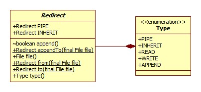
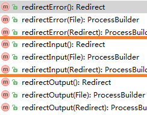
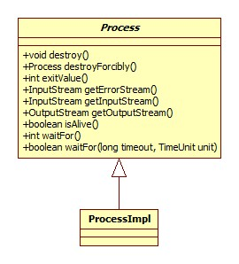

# 命令执行

我们以以下代码为例:

```java
Runtime runtime = Runtime.getRuntime();
String cmd = "ls -l";
Process process = runtime.exec(cmd);
```

实际调用了下面的exec方法:

```java
public Process exec(String command, String[] envp, File dir) {
    StringTokenizer st = new StringTokenizer(command);
    String[] cmdarray = new String[st.countTokens()];
    for (int i = 0; st.hasMoreTokens(); i++)
        cmdarray[i] = st.nextToken();
    return exec(cmdarray, envp, dir);
}
```

第二个参数为环境变量数组，其格式为key=value，第三个参数为命令的执行路径，如果为null，那么便为当前Java进程的工作路径，即user.dir。

StringTokenizer默认以空格、换行符、制表符，换页符(\f)为分隔单位，所以这里将命令`ls -l`分割为了ls和-l两部分。

```java
public Process exec(String[] cmdarray, String[] envp, File dir) {
    return new ProcessBuilder(cmdarray)
        .environment(envp)
        .directory(dir)
        .start();
}
```

其实是用ProcessBuilder实现，此类在JDK1.5时加入。

# ProcessBuilder


## start

start方法简略版源码:

```java
 public Process start() throws IOException {
    String[] cmdarray = command.toArray(new String[command.size()]);
    cmdarray = cmdarray.clone();
    String dir = directory == null ? null : directory.toString();
    return ProcessImpl.start(cmdarray,
                             environment,
                             dir,
                             redirects,
                             redirectErrorStream);
}
```

## Redirect

redirects是一个ProcessBuilder内部的Redirect数组，Redirect为ProcessBuilder的嵌套类，定义了系统的进程的输入或输出:



且redirects数组的大小必定为3，分别代表输入、输出和错误，此数组是lazy-init的，只有当调用其redirects()方法获取整个数组或要设置重定向时才会进行初始化，redirects()源码:

```java
private Redirect[] redirects() {
    if (redirects == null)
        redirects = new Redirect[] {Redirect.PIPE, Redirect.PIPE, Redirect.PIPE};
    return redirects;
}
```

可以看到，默认都是管道类型，这其实很容易理解，每个命令的执行都会导致一个系统进程的创建，我们从进程获得输出，输入必定要通过管道的方式。

## 重定向

其实共有三组方法:



没有参数的表示获取。

### 获取

我们以redirectError为例:

```java
public Redirect redirectError() {
    return (redirects == null) ? Redirect.PIPE : redirects[2];
}
```

### 设置

以redirectInput为例:

```java
public ProcessBuilder redirectInput(File file) {
    //对redirects数组赋值
    return redirectInput(Redirect.from(file));
}
```

from方法其实是对File的包装:

```java
public static Redirect from(final File file) {
    return new Redirect() {
            public Type type() { return Type.READ; }
            public File file() { return file; }
            public String toString() {
                return "redirect to read from file \"" + file + "\"";
            }
        };
}
```

## 输出整合

下面两个方法分别对redirectErrorStream属性进行读取和设置:


如果被设置为true，那么错误输出将会被merge到标准输出。

## 继承 

即Redirect.Type.INHERIT类型。那什么是继承呢?其实就是将启动的进程的输入或输出或错误输出设置为当前Java虚拟机的输入、输出与错误输出。

inheritIO方法源码:

```java
public ProcessBuilder inheritIO() {
    Arrays.fill(redirects(), Redirect.INHERIT);
    return this;
}
```

其实相当于这样:

```java
pb.redirectInput(Redirect.INHERIT).redirectOutput(Redirect.INHERIT).redirectError(Redirect.INHERIT);
```

# Process

代表系统的一个进程。



## start

简略版源码:

```java
static Process start(String cmdarray[], Map<String,String> environment, String dir,
                     ProcessBuilder.Redirect[] redirects,boolean redirectErrorStream) {
    String envblock = ProcessEnvironment.toEnvironmentBlock(environment);
    FileInputStream  f0 = null;
    FileOutputStream f1 = null;
    FileOutputStream f2 = null;
    long[] stdHandles;
    if (redirects == null) {
        stdHandles = new long[] { -1L, -1L, -1L };
    } else {
        stdHandles = new long[3];
        if (redirects[0] == Redirect.PIPE)
            stdHandles[0] = -1L;
        else if (redirects[0] == Redirect.INHERIT)
            stdHandles[0] = fdAccess.getHandle(FileDescriptor.in);
        else {
            f0 = new FileInputStream(redirects[0].file());
            stdHandles[0] = fdAccess.getHandle(f0.getFD());
        }
        //输出和错误完全一样
    }
    return new ProcessImpl(cmdarray, envblock, dir, stdHandles, redirectErrorStream);
}
```

