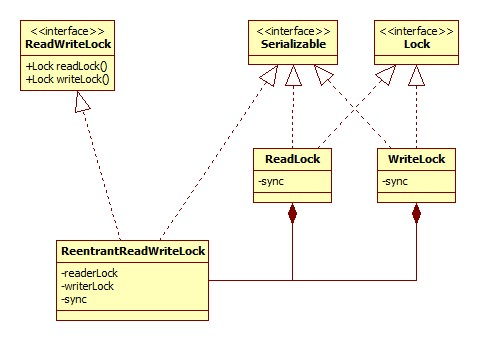
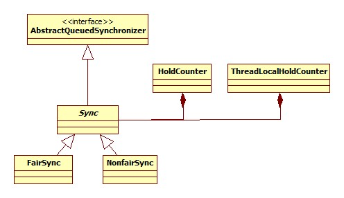

# 类图

## ReadWriteLock



## Sync

ReentrantReadWriteLock内部的Sync的类图如下:



# 构造

默认构造器:

```java
public ReentrantReadWriteLock() {
	this(false);
}
```

含参构造器:

```java
public ReentrantReadWriteLock(boolean fair) {
	sync = fair ? new FairSync() : new NonfairSync();
	readerLock = new ReadLock(this);
	writerLock = new WriteLock(this);
}
```

写锁和读锁的构造器是一个套路，以读锁为例:

```java
protected ReadLock(ReentrantReadWriteLock lock) {
	sync = lock.sync;
}
```

可以看出，**读写锁内部的sync其实就是ReentrantReadWriteLock的sync**。

# 读锁

## lock

ReadLock.lock:

```java
public void lock() {
	sync.acquireShared(1);
}
```

AbstractQueuedSynchronizer.acquireShared:

```java
public final void acquireShared(int arg) {
	if (tryAcquireShared(arg) < 0)
		doAcquireShared(arg);
}
```

tryAcquireShared方法的实现位于Sync:

```java
protected final int tryAcquireShared(int unused) {
	Thread current = Thread.currentThread();
	int c = getState();
	if (exclusiveCount(c) != 0 &&
		getExclusiveOwnerThread() != current)
		return -1;
	int r = sharedCount(c);
	if (!readerShouldBlock() &&
		r < MAX_COUNT &&
		compareAndSetState(c, c + SHARED_UNIT)) {
		if (r == 0) {
			firstReader = current;
			firstReaderHoldCount = 1;
		} else if (firstReader == current) {
			firstReaderHoldCount++;
		} else {
			HoldCounter rh = cachedHoldCounter;
			if (rh == null || rh.tid != getThreadId(current))
				cachedHoldCounter = rh = readHolds.get();
			else if (rh.count == 0)
				readHolds.set(rh);
			rh.count++;
		}
		return 1;
	}
	return fullTryAcquireShared(current);
}
```

以下进行分部分说明。

### 排它锁/写锁检测

如果另一个线程已经持有写锁/排它锁，那么读锁的获得将会马上失败。此部分源码:

```java
Thread current = Thread.currentThread();
int c = getState();
if (exclusiveCount(c) != 0 && getExclusiveOwnerThread() != current)
	return -1;
```

getState值在此处被当做两个short来使用，高16位值代表读锁的持有次数，低16位代表写锁的的持有次数。

```java
static final int SHARED_SHIFT   = 16;
static final int SHARED_UNIT    = (1 << SHARED_SHIFT);
static final int MAX_COUNT      = (1 << SHARED_SHIFT) - 1;
static final int EXCLUSIVE_MASK = (1 << SHARED_SHIFT) - 1;

static int sharedCount(int c)    { return c >>> SHARED_SHIFT; }

static int exclusiveCount(int c) { return c & EXCLUSIVE_MASK; }
```

