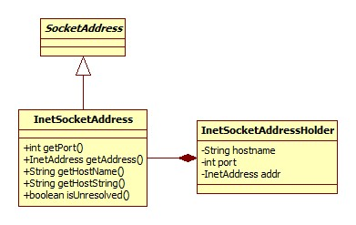
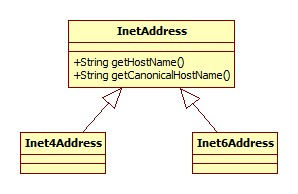
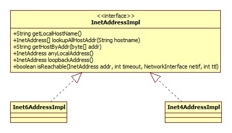
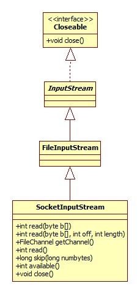

# 客户端连接

先来看一下使用socket作为客户端的使用。假设有代码如下:

```java
public static void main(String[] args) {
    Socket socket = new Socket();
    socket.connect(new InetSocketAddress(8080));
}
```

## 构造器

Socket的默认构造器源码如下:

```java
 public Socket() {
    setImpl();
}
```

setImpl()方法的目的在于设置系统采用的Socket实现，采用SocksSocketImpl。其类图:


SocksSocketImpl.jpg的父类会在静态代码块中进行初始化工作，下面分部分说明。

### 网络库加载

AbstractPlainSocketImpl静态代码块源码:

```java
static {
    java.security.AccessController.doPrivileged(
        new java.security.PrivilegedAction<Void>() {
            public Void run() {
                System.loadLibrary("net");
                return null;
            }
        });
    }
```

通过debug可以发现，对于Windows来说，这加载的实际上是位于jre下的bin/net.dll。

### 启动参数获取

PlainSocketImpl静态代码块源码:

```java
static {
    java.security.AccessController.doPrivileged( new PrivilegedAction<Object>() {
            public Object run() {
                version = 0;
                try {
                    version = Float.parseFloat(System.getProperties().getProperty("os.version"));
                    preferIPv4Stack = Boolean.parseBoolean(
                                      System.getProperties().getProperty("java.net.preferIPv4Stack"));
                    exclBindProp = System.getProperty("sun.net.useExclusiveBind");
                } catch (NumberFormatException e ) {
                    assert false : e;
                }
                return null; // nothing to return
            } });

    // (version >= 6.0) implies Vista or greater.
    if (version >= 6.0 && !preferIPv4Stack) {
            useDualStackImpl = true;
    }
    if (exclBindProp != null) {
        // sun.net.useExclusiveBind is true
        exclusiveBind = exclBindProp.length() == 0 ? true
                : Boolean.parseBoolean(exclBindProp);
    } else if (version < 6.0) {
        exclusiveBind = false;
    }
}
```

java.net.preferIPv4Stack参数默认为false，表示如果系统支持IPV6，那么即使用IPV6 socket，如果设置为true，那么将只使用V4.


### DualStack or TwoStacks

PlainSocketImpl构造器决定了使用哪种Socket实现，源码:

```java
PlainSocketImpl() {
    if (useDualStackImpl) {
        impl = new DualStackPlainSocketImpl(exclusiveBind);
    } else {
        impl = new TwoStacksPlainSocketImpl(exclusiveBind);
    }
}
```

从上一节启动参数获取可以看出当Windows的系统版本大于等于Vista时useDualStackImpl为true，即这些版本的Windows支持通过一个文件描述符同时支持IPV6和V4.而
更低的版本需要使用两个文件描述符做到这一点，这就是两个类类名的意义。

## Socket创建

任何实质性的Socket操作都会导致实际Socket连接的创建，创建通过Socket.createImpl完成:

```java
void createImpl(boolean stream) throws SocketException {
    if (impl == null){
        setImpl();
    }
    impl.create(stream);
    created = true;
}
```

在这里stream始终为true，AbstractPlainSocketImpl.create简略版源码:

```java
protected synchronized void create(boolean stream) {
    this.stream = stream;
    fd = new FileDescriptor();
    socketCreate(true);
    if (socket != null)
        socket.setCreated();
    if (serverSocket != null)
        serverSocket.setCreated();
}
```

FileDescriptor代表系统层面上的一个打开的文件、一个Socket等文件句柄。DualStackPlainSocketImpl.socketCreate:

```java
void socketCreate(boolean stream) {
    if (fd == null)
        throw new SocketException("Socket closed");
    int newfd = socket0(stream, false /*v6 Only*/);
    fdAccess.set(fd, newfd);
}
```

socket0系native方法调用，实现在jdk  windows源码下的DualStackPlainSocketImpl.c:

```c++
JNIEXPORT jint JNICALL Java_java_net_DualStackPlainSocketImpl_socket0
  (JNIEnv *env, jclass clazz, jboolean stream, jboolean v6Only /*unused*/) {
    int fd, rv, opt=0;
    fd = NET_Socket(AF_INET6, (stream ? SOCK_STREAM : SOCK_DGRAM), 0);
    rv = setsockopt(fd, IPPROTO_IPV6, IPV6_V6ONLY, (char *) &opt, sizeof(opt));
    SetHandleInformation((HANDLE)(UINT_PTR)fd, HANDLE_FLAG_INHERIT, FALSE);
    return fd;
}
```

NET_Socket(net_util_md.c)函数:

```c++
int NET_Socket (int domain, int type, int protocol) {
    SOCKET sock;
    sock = socket (domain, type, protocol);
    return (int)sock;
}
```

其中socket便是Windows的Socket API函数，说明:

> ​	应用程序调用socket函数来创建一个能够进行网络通信的套接字。第一个参数指定应用程序使用的通信协议的协议族，对于TCP/IP协议族，该参数置PF_INET;第二个参数指定要创建的套接字类型，流套接字类型为SOCK_STREAM、数据报套接字类型为SOCK_DGRAM；第三个参数指定应用程序所使用的通信协议。
> ​        该函数如果调用成功就返回新创建的套接字的描述符，如果失败就返回INVALID_SOCKET。套接字描述符是一个整数类型的值。每个进程的进程空间里都有一个套接字描述符表，该表中存放着套接字描述符和套接字[数据结构](http://lib.csdn.net/base/datastructure)的对应关系。该表中有一个字段存放新创建的套接字的描述符，另一个字段存放套接字数据结构的地址，因此根据套接字描述符就可以找到其对应的套接字数据结构。每个进程在自己的进程空间里都有一个套接字描述符表但是套接字数据结构都是在操作系统的内核缓冲里。

摘自: [Windows Socket API函数](http://blog.csdn.net/hurtmanzc/article/details/1561840)

AF_INET6指的便是IPV6版本，SOCK_STREAM指的是TCP流，而SOCK_DGRAM指的是UDP包，所以可以猜测，TCP和UDP连接的创建使用的都是一套API。最后一个参数在协议已知的情况下一般就是0.

## 参数设置

所有参数的设置均通过DualStackPlainSocketImpl.setIntOption(int fd, int cmd, int optionValue)完成，fd便是native的文件描述符，cmd是BSD(伯克利) Socket的选项码，在Java里全部定义在接口ScoketOptions中。

最终完成对Windows/Linux setsockopt函数的调用。

## 地址表示

我们通常使用InetSocketAddress对象作为Socket的参数，其类图:



其各种get方法都是委托给InetSocketAddressHolder实现。下面是常用的两参数构造器:

```java
 public InetSocketAddress(String hostname, int port) {
    InetAddress addr = null;
    String host = null;
    try {
        addr = InetAddress.getByName(hostname);
    } catch(UnknownHostException e) {
        host = hostname;
    }
    holder = new InetSocketAddressHolder(host, addr, checkPort(port));
}
```

从这里可以看出，**第一个字符串参数实际上既可以传入hostname也可以传入IP**。从这里引出了InetAddress，它代表了一个IP地址，类图:



InetAddress.getByName方法完成了从hostname/ip到真实地址的解析过程，解析分为几下几种情况:

- 如果给定的是合法的IP地址(V4/V6)，那么停止解析，使用IP。

- "localhost", "127.0.0.1", "0.0.0.0"等为本地地址。

- 如果给定的是hostname，那么将通过NameService进行host查找。InetAddress的静态代码块进行了NameService加载:

  ```java
  static {
    String provider = null;;
    String propPrefix = "sun.net.spi.nameservice.provider.";
    int n = 1;
    nameServices = new ArrayList<NameService>();
    provider = AccessController.doPrivileged(new GetPropertyAction(propPrefix + n));
  }
  ```

  GetPropertyAction源码:

  ```java
  public String run() {
    String var1 = System.getProperty(this.theProp);
    return var1 == null?this.defaultVal:var1;
  }
  ```

  可以看出，JDK允许我们以系统变量的形式设置自己的NameService，不过一般都是没有设置的，这时JDK将使用默认的NameService, InetAddress.createNSProvider部分源码:

  ```java
  private static NameService createNSProvider(String provider) {
    NameService nameService = null;
    if (provider.equals("default")) {
        // initialize the default name service
        nameService = new NameService() {
            public InetAddress[] lookupAllHostAddr(String host) {
                return impl.lookupAllHostAddr(host);
            }
            public String getHostByAddr(byte[] addr) {
                return impl.getHostByAddr(addr);
            }
        };
    }
  }
  ```

  impl是一个InetAddressImpl对象，此接口定义了InetAddress的真正实现，类图:

  

  而系统一般使用前者(Inet6)，而其lookupAllHostAddr方法是native实现。native的实现在Inet6AddressImpl.c，对于Windows来说是通过getaddrinfo函数实现，参考MSDN文档:

  [getaddrinfo](https://msdn.microsoft.com/en-us/library/windows/desktop/ms738520(v=vs.85).aspx)

  可以想到，这应该是一个查询hosts文件、请求DNS的过程。


## 连接

核心代码位于SocksSocketImpl.connect(SocketAddress endpoint, int timeout)方法，默认超时为0，即在成功建立连接之前线程将被阻塞，直到抛出异常。下面进行分部分说明。

### scheme

系统首先会为连接地址添加scheme，相关源码:

```java
 uri = new URI("socket://" + ParseUtil.encodePath(host) + ":"+ epoint.getPort());
```

### ProxySelector

为jdk5.0添加的新的代理角色，关于Java的所有网络代理，参考官方文档:

[Java Networking and Proxies](http://docs.oracle.com/javase/8/docs/technotes/guides/net/proxies.html)

因为默认是没有代理的，连接的核心逻辑位于:

AbstractPlainSocketImpl.connectToAddress，源码:

```java
private void connectToAddress(InetAddress address, int port, int timeout) {
    if (address.isAnyLocalAddress()) {
        doConnect(InetAddress.getLocalHost(), port, timeout);
    } else {
        doConnect(address, port, timeout);
    }
}
```

最终调用DualStackPlainSocketImpl.connect0方法，native实现位于DualStackPlainSocketImpl.c的Java_java_net_DualStackPlainSocketImpl_connect0方法。其实是对Windows API connect()的调用。

## 输入流获取

输出流原理是一样的，不再赘述。

真正的逻辑位于AbstractPlainSocketImpl.getInputStream():

```java
protected synchronized InputStream getInputStream() {
    synchronized (fdLock) {
        if (isClosedOrPending())
            throw new IOException("Socket Closed");
        if (shut_rd)
            throw new IOException("Socket input is shutdown");
        if (socketInputStream == null)
            socketInputStream = new SocketInputStream(this);
    }
    return socketInputStream;
}
```

从这里可以看出，**可以从一个Socket中多次获取输入/出流，但其实都是同一个对象**。SocketInputStream又是个什么东西呢?类图 :



好吧，竟然是FileInputStream的子类。

## 数据读取

以下列程序为例:

```java
InputStream is = socket.getInputStream();
byte[] data = new byte[8];
is.read(data, 0, 8);
```

实现位于SocketInputStream，简略版源码:

```java
int read(byte b[], int off, int length, int timeout) {
    FileDescriptor fd = impl.acquireFD();
    try {
        n = socketRead(fd, b, off, length, timeout);
        if (n > 0) {
            return n;
        }
    } catch (ConnectionResetException rstExc) {
        gotReset = true;
    } finally {
        impl.releaseFD();
    }
}
```

socketRead方法通过native调用SocketInputStream.c的Java_java_net_SocketInputStream_socketRead0函数，最终是Windows的recv函数。

# 服务器

以如下简单的server为例:

```java
ServerSocket ss = new ServerSocket();
ss.bind(new InetSocketAddress(8080));
Socket socket = ss.accept();
```

## 端口绑定

ServerSocket.bind简略版源码:

```java
public void bind(SocketAddress endpoint, int backlog) {
    if (backlog < 1) {
        backlog = 50;
    }
    getImpl().bind(epoint.getAddress(), epoint.getPort());
    getImpl().listen(backlog);
}
```

backlog指socket里的最大排队客户端连接数，默认为50，参考:

 [java socket参数详解:BackLog](http://blog.csdn.net/huang_xw/article/details/7338487)


