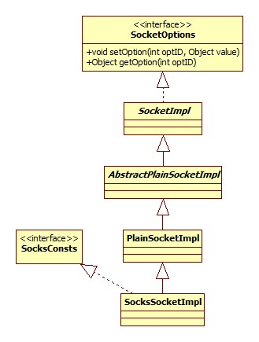

# 客户端连接

先来看一下使用socket作为客户端的使用。假设有代码如下:

```java
public static void main(String[] args) {
    Socket socket = new Socket();
    socket.connect(new InetSocketAddress(8080));
}
```

## 构造器

Socket的默认构造器源码如下:

```java
 public Socket() {
    setImpl();
}
```

setImpl()方法的目的在于设置系统采用的Socket实现，采用SocksSocketImpl。其类图:



SocksSocketImpl.jpg的父类会在静态代码块中进行初始化工作，下面分部分说明。

### 网络库加载

AbstractPlainSocketImpl静态代码块源码:

```java
static {
    java.security.AccessController.doPrivileged(
        new java.security.PrivilegedAction<Void>() {
            public Void run() {
                System.loadLibrary("net");
                return null;
            }
        });
    }
```

通过debug可以发现，对于Windows来说，这加载的实际上是位于jre下的bin/net.dll。

### 启动参数获取

PlainSocketImpl静态代码块源码:

```java
static {
    java.security.AccessController.doPrivileged( new PrivilegedAction<Object>() {
            public Object run() {
                version = 0;
                try {
                    version = Float.parseFloat(System.getProperties().getProperty("os.version"));
                    preferIPv4Stack = Boolean.parseBoolean(
                                      System.getProperties().getProperty("java.net.preferIPv4Stack"));
                    exclBindProp = System.getProperty("sun.net.useExclusiveBind");
                } catch (NumberFormatException e ) {
                    assert false : e;
                }
                return null; // nothing to return
            } });

    // (version >= 6.0) implies Vista or greater.
    if (version >= 6.0 && !preferIPv4Stack) {
            useDualStackImpl = true;
    }
    if (exclBindProp != null) {
        // sun.net.useExclusiveBind is true
        exclusiveBind = exclBindProp.length() == 0 ? true
                : Boolean.parseBoolean(exclBindProp);
    } else if (version < 6.0) {
        exclusiveBind = false;
    }
}
```

java.net.preferIPv4Stack参数默认为false，表示如果系统支持IPV6，那么即使用IPV6 socket，如果设置为true，那么将只使用V4.


### DualStack or TwoStacks

PlainSocketImpl构造器决定了使用哪种Socket实现，源码:

```java
PlainSocketImpl() {
    if (useDualStackImpl) {
        impl = new DualStackPlainSocketImpl(exclusiveBind);
    } else {
        impl = new TwoStacksPlainSocketImpl(exclusiveBind);
    }
}
```

从上一节启动参数获取可以看出当Windows的系统版本大于等于Vista时useDualStackImpl为true，即这些版本的Windows支持通过一个文件描述符同时支持IPV6和V4.而
更低的版本需要使用两个文件描述符做到这一点，这就是两个类类名的意义。

## Socket创建

任何实质性的Socket操作都会导致实际Socket连接的创建，创建通过Socket.createImpl完成:

```java
void createImpl(boolean stream) throws SocketException {
    if (impl == null){
        setImpl();
    }
    impl.create(stream);
    created = true;
}
```

在这里stream始终为true，AbstractPlainSocketImpl.create简略版源码:

```java
protected synchronized void create(boolean stream) {
    this.stream = stream;
    fd = new FileDescriptor();
    socketCreate(true);
    if (socket != null)
        socket.setCreated();
    if (serverSocket != null)
        serverSocket.setCreated();
}
```

FileDescriptor代表系统层面上的一个打开的文件、一个Socket等文件句柄。DualStackPlainSocketImpl.socketCreate:

```java
void socketCreate(boolean stream) {
    if (fd == null)
        throw new SocketException("Socket closed");
    int newfd = socket0(stream, false /*v6 Only*/);
    fdAccess.set(fd, newfd);
}
```

socket0系native方法调用，实现在jdk  windows源码下的DualStackPlainSocketImpl.c:

```c++
JNIEXPORT jint JNICALL Java_java_net_DualStackPlainSocketImpl_socket0
  (JNIEnv *env, jclass clazz, jboolean stream, jboolean v6Only /*unused*/) {
    int fd, rv, opt=0;
    fd = NET_Socket(AF_INET6, (stream ? SOCK_STREAM : SOCK_DGRAM), 0);
    rv = setsockopt(fd, IPPROTO_IPV6, IPV6_V6ONLY, (char *) &opt, sizeof(opt));
    SetHandleInformation((HANDLE)(UINT_PTR)fd, HANDLE_FLAG_INHERIT, FALSE);
    return fd;
}
```

NET_Socket(net_util_md.c)函数:

```c++
int NET_Socket (int domain, int type, int protocol) {
    SOCKET sock;
    sock = socket (domain, type, protocol);
    return (int)sock;
}
```

其中socket便是Windows的Socket API函数，说明:

> ​	应用程序调用socket函数来创建一个能够进行网络通信的套接字。第一个参数指定应用程序使用的通信协议的协议族，对于TCP/IP协议族，该参数置PF_INET;第二个参数指定要创建的套接字类型，流套接字类型为SOCK_STREAM、数据报套接字类型为SOCK_DGRAM；第三个参数指定应用程序所使用的通信协议。
> ​        该函数如果调用成功就返回新创建的套接字的描述符，如果失败就返回INVALID_SOCKET。套接字描述符是一个整数类型的值。每个进程的进程空间里都有一个套接字描述符表，该表中存放着套接字描述符和套接字[数据结构](http://lib.csdn.net/base/datastructure)的对应关系。该表中有一个字段存放新创建的套接字的描述符，另一个字段存放套接字数据结构的地址，因此根据套接字描述符就可以找到其对应的套接字数据结构。每个进程在自己的进程空间里都有一个套接字描述符表但是套接字数据结构都是在操作系统的内核缓冲里。

摘自: [Windows Socket API函数](http://blog.csdn.net/hurtmanzc/article/details/1561840)

AF_INET6指的便是IPV6版本，SOCK_STREAM指的是TCP流，而SOCK_DGRAM指的是UDP包，所以可以猜测，TCP和UDP连接的创建使用的都是一套API。最后一个参数在协议已知的情况下一般就是0.

## 参数设置

所有参数的设置均通过DualStackPlainSocketImpl.setIntOption(int fd, int cmd, int optionValue)完成，fd便是native的文件描述符，cmd是BSD(伯克利) Socket的选项码，在Java里全部定义在接口ScoketOptions中。

最终完成对Windows/Linux setsockopt函数的调用。

## 地址表示

我们通常使用InetSocketAddress对象作为Socket的参数，其类图:


其各种get方法都是委托给InetSocketAddressHolder实现。下面是常用的两参数构造器:

```java
 public InetSocketAddress(String hostname, int port) {
    InetAddress addr = null;
    String host = null;
    try {
        addr = InetAddress.getByName(hostname);
    } catch(UnknownHostException e) {
        host = hostname;
    }
    holder = new InetSocketAddressHolder(host, addr, checkPort(port));
}
```

从这里可以看出，**第一个字符串参数实际上既可以传入hostname也可以传入IP**。从这里引出了InetAddress，它代表了一个IP地址，类图:


InetAddress.getByName方法完成了从hostname/ip到真实地址的解析过程，解析分为几下几种情况:

- 如果给定的是合法的IP地址(V4/V6)，那么停止解析，使用IP。

- "localhost", "127.0.0.1", "0.0.0.0"等为本地地址。

- 如果给定的是hostname，那么将通过NameService进行host查找。InetAddress的静态代码块进行了NameService加载:

  ```java
  static {
    String provider = null;;
    String propPrefix = "sun.net.spi.nameservice.provider.";
    int n = 1;
    nameServices = new ArrayList<NameService>();
    provider = AccessController.doPrivileged(new GetPropertyAction(propPrefix + n));
  }
  ```

  GetPropertyAction源码:

  ```java
  public String run() {
    String var1 = System.getProperty(this.theProp);
    return var1 == null?this.defaultVal:var1;
  }
  ```

  可以看出，JDK允许我们以系统变量的形式设置自己的NameService，不过一般都是没有设置的，这时JDK将使用默认的NameService, InetAddress.createNSProvider部分源码:

  ```java
  private static NameService createNSProvider(String provider) {
    NameService nameService = null;
    if (provider.equals("default")) {
        // initialize the default name service
        nameService = new NameService() {
            public InetAddress[] lookupAllHostAddr(String host) {
                return impl.lookupAllHostAddr(host);
            }
            public String getHostByAddr(byte[] addr) {
                return impl.getHostByAddr(addr);
            }
        };
    }
  }
  ```

  impl是一个InetAddressImpl对象，此接口定义了InetAddress的真正实现，类图:

  

  而系统一般使用前者(Inet6)，而其lookupAllHostAddr方法是native实现。native的实现在Inet6AddressImpl.c，对于Windows来说是通过getaddrinfo函数实现，参考MSDN文档:

  [getaddrinfo](https://msdn.microsoft.com/en-us/library/windows/desktop/ms738520(v=vs.85).aspx)

  可以想到，这应该是一个查询hosts文件、请求DNS的过程。


## 连接

核心代码位于SocksSocketImpl.connect(SocketAddress endpoint, int timeout)方法，默认超时为0，即在成功建立连接之前线程将被阻塞，直到抛出异常。下面进行分部分说明。

### scheme

系统首先会为连接地址添加scheme，相关源码:

```java
 uri = new URI("socket://" + ParseUtil.encodePath(host) + ":"+ epoint.getPort());
```

### ProxySelector

为jdk5.0添加的新的代理角色，关于Java的所有网络代理，参考官方文档:

[Java Networking and Proxies](http://docs.oracle.com/javase/8/docs/technotes/guides/net/proxies.html)

因为默认是没有代理的，连接的核心逻辑位于:

AbstractPlainSocketImpl.connectToAddress，源码:

```java
private void connectToAddress(InetAddress address, int port, int timeout) {
    if (address.isAnyLocalAddress()) {
        doConnect(InetAddress.getLocalHost(), port, timeout);
    } else {
        doConnect(address, port, timeout);
    }
}
```

最终调用DualStackPlainSocketImpl.connect0方法，native实现位于DualStackPlainSocketImpl.c的Java_java_net_DualStackPlainSocketImpl_connect0方法。其实是对Windows API connect()的调用。

## 输入流获取

输出流原理是一样的，不再赘述。

真正的逻辑位于AbstractPlainSocketImpl.getInputStream():

```java
protected synchronized InputStream getInputStream() {
    synchronized (fdLock) {
        if (isClosedOrPending())
            throw new IOException("Socket Closed");
        if (shut_rd)
            throw new IOException("Socket input is shutdown");
        if (socketInputStream == null)
            socketInputStream = new SocketInputStream(this);
    }
    return socketInputStream;
}
```

从这里可以看出，**可以从一个Socket中多次获取输入/出流，但其实都是同一个对象**。SocketInputStream又是个什么东西呢?类图 :


好吧，竟然是FileInputStream的子类。

## 数据读取

以下列程序为例:

```java
InputStream is = socket.getInputStream();
byte[] data = new byte[8];
is.read(data, 0, 8);
```

实现位于SocketInputStream，简略版源码:

```java
int read(byte b[], int off, int length, int timeout) {
    FileDescriptor fd = impl.acquireFD();
    try {
        n = socketRead(fd, b, off, length, timeout);
        if (n > 0) {
            return n;
        }
    } catch (ConnectionResetException rstExc) {
        gotReset = true;
    } finally {
        impl.releaseFD();
    }
}
```

socketRead方法通过native调用SocketInputStream.c的Java_java_net_SocketInputStream_socketRead0函数，最终是Windows的recv函数。

# 服务器

以如下简单的server为例:

```java
ServerSocket ss = new ServerSocket();
ss.bind(new InetSocketAddress(8080));
Socket socket = ss.accept();
```

## 端口绑定

ServerSocket.bind简略版源码:

```java
public void bind(SocketAddress endpoint, int backlog) {
    if (backlog < 1) {
        backlog = 50;
    }
    getImpl().bind(epoint.getAddress(), epoint.getPort());
    getImpl().listen(backlog);
}
```

backlog指socket里的最大排队客户端连接数，默认为50，参考:

 [java socket参数详解:BackLog](http://blog.csdn.net/huang_xw/article/details/7338487)

### bind

真正的实现在DualStackPlainSocketImpl.socketBind，简略版源码:

```java
 void socketBind(InetAddress address, int port) {
	int nativefd = checkAndReturnNativeFD();
	bind0(nativefd, address, port, exclusiveBind);
	if (port == 0) {
		localport = localPort0(nativefd);
	} else {
		localport = port;
	}
	this.address = address;
}
```

bind0和localPort0，native实现。

### listen

实现位于DualStackPlainSocketImpl.socketListen:

```java
void socketListen(int backlog) {
	int nativefd = checkAndReturnNativeFD();
	listen0(nativefd, backlog);
}
```

native实现。从这里可以看出，**Java层面上的bind其实是系统级上的bind和listen两个操作**。

## accept

核心实现位于DualStackPlainSocketImpl.socketAccept，源码:

```java
void socketAccept(SocketImpl s) throws IOException {
	int nativefd = checkAndReturnNativeFD();
	int newfd = -1;
	InetSocketAddress[] isaa = new InetSocketAddress[1];
	if (timeout <= 0) {
		newfd = accept0(nativefd, isaa);
	} else {
		configureBlocking(nativefd, false);
		try {
			waitForNewConnection(nativefd, timeout);
			newfd = accept0(nativefd, isaa);
			if (newfd != -1) {
				configureBlocking(newfd, true);
			}
		} finally {
			configureBlocking(nativefd, true);
		}
	}
	/* Update (SocketImpl)s' fd */
	fdAccess.set(s.fd, newfd);
	/* Update socketImpls remote port, address and localport */
	InetSocketAddress isa = isaa[0];
	s.port = isa.getPort();
	s.address = isa.getAddress();
	s.localport = localport;
}
```

可以看出，代表客户端连接的Socket对象其实是先创建的，accept其实是一个调用native实现然后再更新Socket文件描述符的过程。

accept0对应Windows(Linux其实也是一样的)的accept函数，accept默认工作在阻塞模式，configureBlocking对应Windows的ioctlsocket函数，waitForNewConnection对应Windows的select函数，ioctlsocket用以改变Socket的阻塞模式。这样Java accept的超时机制实现也就好理解了。

# 总结

Java的Socket实现其实是对系统API的一层封装，得到的IO流其实是在Socket的read、write之上抽象出来的对象。

# 参数整理

记录一下SocketOptions里定义的各选项的意义。

## TCP_NODELAY

如果设为true，等于关闭了纳格算法，也就避免了write + write + read时的40ms延时，参考:

[java socket参数详解:TcpNoDelay](http://blog.csdn.net/huang_xw/article/details/7340241)

[再说TCP神奇的40ms](https://www.qcloud.com/community/article/186)

## SO_BINDADDR

此选项不可更改，用以获取服务器绑定的端口。

## SO_REUSEADDR

> 如果端口忙，但TCP状态位于 TIME_WAIT ，可以重用 端口。如果端口忙，而TCP状态位于其他状态，重用端口时依旧得到一个错误信息， 抛出“Address already in use： JVM_Bind”。如果你的服务程序停止后想立即重启，不等60秒，而新套接字依旧 使用同一端口，此时 SO_REUSEADDR 选项非常有用。必须意识到，此时任何非期 望数据到达，都可能导致服务程序反应混乱，不过这只是一种可能，事实上很不可能。

摘自: [几个重要的TCP/IP选项解析(Java Socket)](http://www.open-open.com/lib/view/open1412994697952.html)

但是根据Java相应注释，此参数只对MulticastSockets有效，且默认设置。

## SO_BROADCAST

允许连接发送广播消息，前提是所在的主机和网络支持广播消息。在Java里对DatagramSockets有效，且默认设置。

## SO_LINGER

> 这个Socket选项可以影响close方法的行为。在默认情况下，当调用close方法后，将立即返回；如果这时仍然有未被送出的数据包，那么这 些数据包将被丢弃。如果将linger参数设为一个正整数n时（n的值最大是65535），在调用close方法后，将最多被阻塞n秒。在这n秒内，系 统将尽量将未送出的数据包发送出去；如果超过了n秒，如果还有未发送的数据包，这些数据包将全部被丢弃；而close方法会立即返回。如果将linger 设为0，和关闭SO_LINGER选项的作用是一样的。

单词linger的意思是: 徘徊，磨蹭。

## SO_TIMEOUT

> 这个Socket选项在前面已经讨论过。可以通过这个选项来设置读取数据超时。当输入流的read方法被阻塞时，如果设置 timeout（timeout的单位是毫秒），那么系统在等待了timeout毫秒后会抛出一个InterruptedIOException例外。在 抛出例外后，输入流并未关闭，你可以继续通过read方法读取数据。
>
> 如果将timeout设为0，就意味着read将会无限等待下去，直到服务端程序关闭这个Socket.这也是timeout的默认值。

## SO_SNDBUF

发送缓冲区的大小，注意这里不同于BufferedOutputStream，前者是对底层操作系统的一个提示，而后者是在Java层面进行提示。

## SO_RCVBUF

见楼上。

## SO_KEEPALIVE

> 如果将这个Socket选项打开，客户端Socket每隔段的时间（大约两个小时）就会利用空闲的连接向服务器发送一个数据包。这个数据包并没有其 它的作用，只是为了检测一下服务器是否仍处于活动状态。如果服务器未响应这个数据包，在大约11分钟后，客户端Socket再发送一个数据包，如果在12 分钟内，服务器还没响应，那么客户端Socket将关闭。如果将Socket选项关闭，客户端Socket在服务器无效的情况下可能会长时间不会关闭。
>
> SO_KEEPALIVE选项在默认情况下是关闭的。

## SO_OOBINLINE

默认关闭，这会导致urgent data被丢弃。参见Socket的sendUrgentData方法。

我们来看一下这东西是怎么实现的，DualStackPlainSocketImpl.c JNICALL Java_java_net_DualStackPlainSocketImpl_sendOOB方法核心代码:

```c++
//取低8位
unsigned char d = (unsigned char) data & 0xff;
n = send(fd, (char *)&data, 1, MSG_OOB);
```

Windows API send方法前三个参数分别为: 文件描述符，消息指针，消息长度(字节)，关键就在最后一个参数，OOB是Out-of-Band的缩写，为TCP的带外消息。在TCP传输中带内与带外相当于两个独立的逻辑传输通道，但因为RFC规范冲突此种消息不被建议使用，而是应当自己在应用层面上进行实现。参考:

[Java Out Of Band (called “urgent data”) data](http://stackoverflow.com/questions/15249635/java-out-of-band-called-urgent-data-data)


