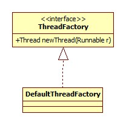
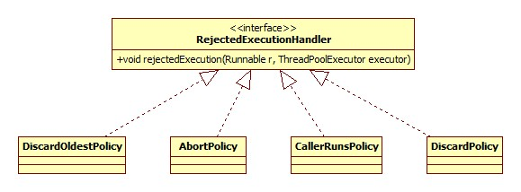
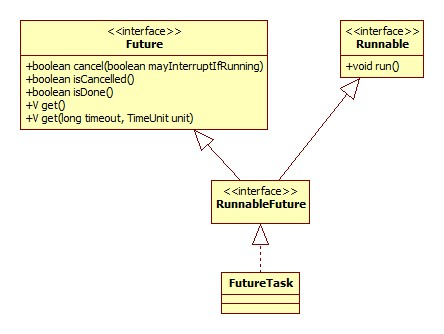

# 创建

我们以下列代码为例:

```java
public static ExecutorService newFixedThreadPool(int nThreads) {
    return new ThreadPoolExecutor(nThreads, nThreads,
        0L, TimeUnit.MILLISECONDS,
        new LinkedBlockingQueue<Runnable>());
}
```

可见默认使用LinkedBlockingQueue作为工作队列，其构造器:

```java
public LinkedBlockingQueue() {
    this(Integer.MAX_VALUE);
}
```

可见，这其实是一个有界队列，虽然大小为int最大值。

ThreadPoolExecutor便是JDK线程池的核心了，类图:


ThreadPoolExecutor构造器:

```java
public ThreadPoolExecutor(int corePoolSize,
                          int maximumPoolSize,
                          long keepAliveTime,
                          TimeUnit unit,
                          BlockingQueue<Runnable> workQueue) {
    this(corePoolSize, maximumPoolSize, keepAliveTime, unit, workQueue,
         Executors.defaultThreadFactory(), defaultHandler);
}
```

## 线程工厂



默认的线程工厂是Executors的内部类，核心的newThread方法:

```java
public Thread newThread(Runnable r) {
    Thread t = new Thread(group, r, namePrefix + threadNumber.getAndIncrement(), 0);
    if (t.isDaemon())
        t.setDaemon(false);
    if (t.getPriority() != Thread.NORM_PRIORITY)
        t.setPriority(Thread.NORM_PRIORITY);
    return t;
}
```

namePrefix定义:

```java
namePrefix = "pool-" + poolNumber.getAndIncrement() + "-thread-";
```

这便是为线程池默认创建的线程起名的地方了，Thread构造器的最后一个0为stackSize，0表示忽略此参数。

## 拒绝策略

从上面可以看出，线程池默认使用有界队列，所以当队列满的时候就需要考虑如何处理这种情况。



线程池默认采用的是:

```java
private static final RejectedExecutionHandler defaultHandler = new AbortPolicy();
```

即抛出异常，线程池退出:

```java
public void rejectedExecution(Runnable r, ThreadPoolExecutor e) {
    throw new RejectedExecutionException("Task " + r.toString() + " rejected from " + e.toString());
}
```

# execute

```java
public void execute(Runnable command) {
    if (command == null)
        throw new NullPointerException();
    int c = ctl.get();
    //corePoolSize为volatile，下面会提到为什么
    if (workerCountOf(c) < corePoolSize) {
        if (addWorker(command, true))
            //创建新线程成功，交由其执行
            return;
        c = ctl.get();
    }
    if (isRunning(c) && workQueue.offer(command)) {
        int recheck = ctl.get();
        if (! isRunning(recheck) && remove(command))
            reject(command);
        else if (workerCountOf(recheck) == 0)
            addWorker(null, false);
    }
    else if (!addWorker(command, false))
        reject(command);
}
```

## 控制变量

ctl是线程池的核心控制变量:

```java
private final AtomicInteger ctl = new AtomicInteger(ctlOf(RUNNING, 0));
```

有以下两个用途:

- 高3位标志线程池的运行状态，比如运行、关闭。
- 低29位存储当前工作线程的个数，所以**一个线程池最多可以创建2 ^ 29 - 1(约为5亿)个线程**。

## 线程创建

当我们调用execute方法时，线程池将首先检查当前线程数是否已达到上限，如果没有创建新的工作线程，而不是入队。

```java
private boolean addWorker(Runnable firstTask, boolean core) {
    retry:
    for (;;) {
        int c = ctl.get();
        int rs = runStateOf(c);
        // 检查线程池状态，如果已关闭，返回false
        if (rs >= SHUTDOWN && ! (rs == SHUTDOWN && firstTask == null && ! workQueue.isEmpty()))
            return false;
        for (;;) {
            int wc = workerCountOf(c);
            //检查是否达到上限
            if (wc >= CAPACITY || wc >= (core ? corePoolSize : maximumPoolSize))
                return false;
            //如果CAS增加线程数成功，中断循环 ，进行线程创建
            if (compareAndIncrementWorkerCount(c))
                break retry;
            c = ctl.get();  // Re-read ctl
            if (runStateOf(c) != rs)
                continue retry;
            // else CAS failed due to workerCount change; retry inner loop
        }
    }

    boolean workerStarted = false;
    boolean workerAdded = false;
    Worker w = null;
    try {
        w = new Worker(firstTask);
        final Thread t = w.thread;
        if (t != null) {
            final ReentrantLock mainLock = this.mainLock;
            //shutdown等方法也需要加锁，所以可以保证线程安全
            mainLock.lock();
            try {
                //再次检查状态
                int rs = runStateOf(ctl.get());
                if (rs < SHUTDOWN || (rs == SHUTDOWN && firstTask == null)) {
                    if (t.isAlive()) // precheck that t is startable
                        throw new IllegalThreadStateException();
                    //workers是一个HashSet
                    workers.add(w);
                    int s = workers.size();
                    //用于记录出现过的最大线程数
                    if (s > largestPoolSize)
                        largestPoolSize = s;
                    workerAdded = true;
                }
            } finally {
                mainLock.unlock();
            }
            if (workerAdded) {
                t.start();
                workerStarted = true;
            }
        }
    } finally {
        if (! workerStarted)
            addWorkerFailed(w);
    }
    return workerStarted;
}
```

### Worker

这里的"线程(即Worker)"其实是ThreadPoolExecutor的内部类。


又见AQS。构造器:

```java
Worker(Runnable firstTask) {
    setState(-1); // inhibit interrupts until runWorker
    this.firstTask = firstTask;
    this.thread = getThreadFactory().newThread(this);
}
```

其run方法的真正逻辑由ThreadPoolExecutor.runWorker实现:

```java
final void runWorker(Worker w) {
    Thread wt = Thread.currentThread();
    Runnable task = w.firstTask;
    w.firstTask = null;
    boolean completedAbruptly = true;
    try {
        while (task != null || (task = getTask()) != null) {
            w.lock();
            //中断状态
            if ((runStateAtLeast(ctl.get(), STOP) || (Thread.interrupted() &&
                 runStateAtLeast(ctl.get(), STOP))) && !wt.isInterrupted())
                wt.interrupt();
            try {
                task.run();
            } finally {
                task = null;
                w.completedTasks++;
                w.unlock();
            }
        }
        completedAbruptly = false;
    } finally {
        processWorkerExit(w, completedAbruptly);
    }
}
```

#### 锁

可以看出，一次任务的执行是在所在Worker的锁的保护下进行的，结合后面shutdownNow的源码可以发现，shutdownNow中断Worker的前提是获得锁，这就很好的体现了shutdownNow的语义: 阻止新任务的提交，**等待**所有已有任务执行完毕。

#### 中断状态

这里有两种意义 :

- 如果线程池处于STOP(或之后)的状态，即shutdownNow方法已被调用，那么此处代码将确保线程的中断标志位一定被设置。
- 如果线程池处于STOP之前的状态，比如SHUTDOWN或RUNNING，那么Worker不应响应中断，即应当清除中断标志，但是暂时没有想到谁会设置Worker线程的中断标志位，难道是我们的业务代码?

在这里扒一扒到底什么是线程中断:

```java
public void interrupt() {
    synchronized (blockerLock) {
        Interruptible b = blocker;
        if (b != null) {
            interrupt0();           // Just to set the interrupt flag
            b.interrupt(this);
            return;
        }
    }
    interrupt0();
}
```

blocker在nio部分已经见过了，interrupt0的最终native实现位于openjdk\hotspot\src\os\solaris\vm\os_solaris.cpp(Linux):

```c++
void os::interrupt(Thread* thread) {
  OSThread* osthread = thread->osthread();
  int isInterrupted = osthread->interrupted();
  if (!isInterrupted) {
      //设置标志位
      osthread->set_interrupted(true);
      OrderAccess::fence();
      //唤醒sleep()?
      ParkEvent * const slp = thread->_SleepEvent ;
      if (slp != NULL) slp->unpark() ;
  }
  //唤醒LockSupport.park()?
  if (thread->is_Java_thread()) {
    ((JavaThread*)thread)->parker()->unpark();
  }
  //唤醒Object.wait()?
  ParkEvent * const ev = thread->_ParkEvent ;
  if (ev != NULL) ev->unpark() ;
  // When events are used everywhere for os::sleep, then this thr_kill
  // will only be needed if UseVMInterruptibleIO is true.
  if (!isInterrupted) {
    int status = thr_kill(osthread->thread_id(), os::Solaris::SIGinterrupt());
    assert_status(status == 0, status, "thr_kill");
    // Bump thread interruption counter
    RuntimeService::record_thread_interrupt_signaled_count();
  }
}
```

与java里已知的可被中断的阻塞大体可以找到对应关系。

#### 任务获取

```java
private Runnable getTask() {
    boolean timedOut = false; // Did the last poll() time out?
    for (;;) {
        int c = ctl.get();
        int rs = runStateOf(c);
        // 线程池已经关闭且队列中没有剩余的任务，退出
        if (rs >= SHUTDOWN && (rs >= STOP || workQueue.isEmpty())) {
            decrementWorkerCount();
            return null;
        }
        int wc = workerCountOf(c);
        // 如果启用了超时并且已经超时且队列中没有任务，线程退出
        boolean timed = allowCoreThreadTimeOut || wc > corePoolSize;
        if ((wc > maximumPoolSize || (timed && timedOut)) && (wc > 1 || workQueue.isEmpty())) {
            if (compareAndDecrementWorkerCount(c))
                return null;
            continue;
        }
        try {
            Runnable r = timed ? workQueue.poll(keepAliveTime, TimeUnit.NANOSECONDS) : workQueue.take();
            if (r != null)
                return r;
            timedOut = true;
        } catch (InterruptedException retry) {
            //如果被中断不是马上退出，而是在下一次循环中检查线程池状态
            timedOut = false;
        }
    }
}
```

结合runWorker方法可以发现，如果getTask返回null，那么即说明当前Worker线程应该退出。

##### 超时

allowCoreThreadTimeOut定义如下:

```java
private volatile boolean allowCoreThreadTimeOut;
```

默认为false，如果开启，Worker不会无限期等待任务，而是超时之后便退出。我们可以通过allowCoreThreadTimeOut方法进行设置:

```java
public void allowCoreThreadTimeOut(boolean value) {
    if (value && keepAliveTime <= 0)
        throw new IllegalArgumentException("Core threads must have nonzero keep alive times");
    if (value != allowCoreThreadTimeOut) {
        allowCoreThreadTimeOut = value;
        if (value)
            interruptIdleWorkers();
    }
}
```

注意同时需传入一个大于零的keepAliveTime。

#### 退出

Worker在退出时将触发processWorkerExit方法:

```java
private void processWorkerExit(Worker w, boolean completedAbruptly) {
    if (completedAbruptly) // If abrupt, then workerCount wasn't adjusted
        decrementWorkerCount();

    final ReentrantLock mainLock = this.mainLock;
    mainLock.lock();
    try {
        completedTaskCount += w.completedTasks;
        workers.remove(w);
    } finally {
        mainLock.unlock();
    }

    tryTerminate();

    int c = ctl.get();
    if (runStateLessThan(c, STOP)) {
        if (!completedAbruptly) {
            int min = allowCoreThreadTimeOut ? 0 : corePoolSize;
            if (min == 0 && ! workQueue.isEmpty())
                min = 1;
            if (workerCountOf(c) >= min)
                return; // replacement not needed
        }
        addWorker(null, false);
    }
}
```

其逻辑可以分为3个部分。

##### 状态修改

线程池内部使用如下变量统计总共完成的任务数:

```java
private long completedTaskCount;
```

在退出时Worker线程将自己完成的数量加至以上变量中。并且将自身从Worker Set中移除。

##### 关闭线程池

tryTerminate方法将会尝试关闭线程池。

```java
final void tryTerminate() {
    for (;;) {
        int c = ctl.get();
        if (isRunning(c) || runStateAtLeast(c, TIDYING) ||
            (runStateOf(c) == SHUTDOWN && ! workQueue.isEmpty()))
            return;
        if (workerCountOf(c) != 0) { // Eligible to terminate
            interruptIdleWorkers(ONLY_ONE);
            return;
        }
        final ReentrantLock mainLock = this.mainLock;
        mainLock.lock();
        try {
            if (ctl.compareAndSet(c, ctlOf(TIDYING, 0))) {
                try {
                    //空实现
                    terminated();
                } finally {
                    ctl.set(ctlOf(TERMINATED, 0));
                    termination.signalAll();
                }
                return;
            }
        } finally {
            mainLock.unlock();
        }
        // else retry on failed CAS
    }
}
```

什么情况下才会尝试调用interruptIdleWorkers呢?

- 当前状态为STOP，即执行了shutdownNow()方法。
- 当前状态为SHUTDOWN且任务队列为null，这正对应shutdown()方法被调用且所有任务已执行完毕。

那么为什么只中断一个Worker线程而不是全部呢?猜测是这相当于链式唤醒，一个唤醒另一个直到最后一个将状态最终修改为TERMINATED。

```java
termination.signalAll();
```

用于唤醒正在等待线程终结的线程，termination定义如下:

```java
private final Condition termination = mainLock.newCondition();
```

awaitTermination方法部分源码:

```java
nanos = termination.awaitNanos(nanos);
```

##### 线程重生

为什么叫重生呢?首先回顾一下runWorker方法任务执行的相关源码:

```java
try {
    task.run();
} catch (RuntimeException x) {
    thrown = x; throw x;
} catch (Error x) {
    thrown = x; throw x;
} catch (Throwable x) {
    thrown = x; throw new Error(x);
} finally {
    afterExecute(task, thrown);
}
```

可以看到，**异常又被重新抛了出去**，也就是说如果我们任务出现了未检查异常就会导致Worker线程的退出，而processWorkerExit方法将会检测当前线程池是否还需要再增加Worker，如果是由于任务逻辑异常导致的退出势必是需要增加的，这便是"重生"。

# submit

我们以单参数Callable<T> task方法为例，AbstractExecutorService.submit:

```java
public <T> Future<T> submit(Callable<T> task) {
    RunnableFuture<T> ftask = newTaskFor(task);
    execute(ftask);
    return ftask;
}
```

AbstractExecutorService.newTaskFor:

```java
protected <T> RunnableFuture<T> newTaskFor(Callable<T> callable) {
    return new FutureTask<T>(callable);
}
```

被包装成了一个FutureTask对象:



FutureTask组合了Runnable和Future两个接口。下面我们来看一下其主要方法的实现。

## get

```java
public V get() {
    int s = state;
    if (s <= COMPLETING)
        s = awaitDone(false, 0L);
    return report(s);
}
```

state为状态标识，其声明(和可取的值)如下:

```java
private volatile int state;
private static final int NEW          = 0;
private static final int COMPLETING   = 1;
private static final int NORMAL       = 2;
private static final int EXCEPTIONAL  = 3;
private static final int CANCELLED    = 4;
private static final int INTERRUPTING = 5;
private static final int INTERRUPTED  = 6;
```


