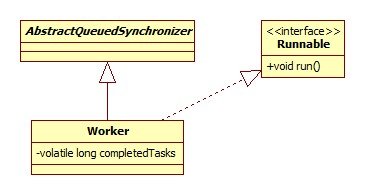
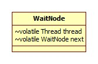

# 创建

我们以下列代码为例:

```java
public static ExecutorService newFixedThreadPool(int nThreads) {
    return new ThreadPoolExecutor(nThreads, nThreads,
        0L, TimeUnit.MILLISECONDS,
        new LinkedBlockingQueue<Runnable>());
}
```

可见默认使用LinkedBlockingQueue作为工作队列，其构造器:

```java
public LinkedBlockingQueue() {
    this(Integer.MAX_VALUE);
}
```

可见，这其实是一个有界队列，虽然大小为int最大值。

ThreadPoolExecutor便是JDK线程池的核心了，类图:


ThreadPoolExecutor构造器:

```java
public ThreadPoolExecutor(int corePoolSize,
                          int maximumPoolSize,
                          long keepAliveTime,
                          TimeUnit unit,
                          BlockingQueue<Runnable> workQueue) {
    this(corePoolSize, maximumPoolSize, keepAliveTime, unit, workQueue,
         Executors.defaultThreadFactory(), defaultHandler);
}
```

## 线程工厂


默认的线程工厂是Executors的内部类，核心的newThread方法:

```java
public Thread newThread(Runnable r) {
    Thread t = new Thread(group, r, namePrefix + threadNumber.getAndIncrement(), 0);
    if (t.isDaemon())
        t.setDaemon(false);
    if (t.getPriority() != Thread.NORM_PRIORITY)
        t.setPriority(Thread.NORM_PRIORITY);
    return t;
}
```

namePrefix定义:

```java
namePrefix = "pool-" + poolNumber.getAndIncrement() + "-thread-";
```

这便是为线程池默认创建的线程起名的地方了，Thread构造器的最后一个0为stackSize，0表示忽略此参数。

## 拒绝策略

从上面可以看出，线程池默认使用有界队列，所以当队列满的时候就需要考虑如何处理这种情况。


线程池默认采用的是:

```java
private static final RejectedExecutionHandler defaultHandler = new AbortPolicy();
```

即抛出异常，线程池退出:

```java
public void rejectedExecution(Runnable r, ThreadPoolExecutor e) {
    throw new RejectedExecutionException("Task " + r.toString() + " rejected from " + e.toString());
}
```

# execute

```java
public void execute(Runnable command) {
    if (command == null)
        throw new NullPointerException();
    int c = ctl.get();
    //corePoolSize为volatile，下面会提到为什么
    if (workerCountOf(c) < corePoolSize) {
        if (addWorker(command, true))
            //创建新线程成功，交由其执行
            return;
        c = ctl.get();
    }
    if (isRunning(c) && workQueue.offer(command)) {
        int recheck = ctl.get();
        if (! isRunning(recheck) && remove(command))
            reject(command);
        else if (workerCountOf(recheck) == 0)
            addWorker(null, false);
    }
    else if (!addWorker(command, false))
        reject(command);
}
```

## 控制变量

ctl是线程池的核心控制变量:

```java
private final AtomicInteger ctl = new AtomicInteger(ctlOf(RUNNING, 0));
```

有以下两个用途:

- 高3位标志线程池的运行状态，比如运行、关闭。
- 低29位存储当前工作线程的个数，所以**一个线程池最多可以创建2 ^ 29 - 1(约为5亿)个线程**。

## 线程创建

当我们调用execute方法时，线程池将首先检查当前线程数是否已达到上限，如果没有创建新的工作线程，而不是入队。

```java
private boolean addWorker(Runnable firstTask, boolean core) {
    retry:
    for (;;) {
        int c = ctl.get();
        int rs = runStateOf(c);
        // 检查线程池状态，如果已关闭，返回false
        if (rs >= SHUTDOWN && ! (rs == SHUTDOWN && firstTask == null && ! workQueue.isEmpty()))
            return false;
        for (;;) {
            int wc = workerCountOf(c);
            //检查是否达到上限
            if (wc >= CAPACITY || wc >= (core ? corePoolSize : maximumPoolSize))
                return false;
            //如果CAS增加线程数成功，中断循环 ，进行线程创建
            if (compareAndIncrementWorkerCount(c))
                break retry;
            c = ctl.get();  // Re-read ctl
            if (runStateOf(c) != rs)
                continue retry;
            // else CAS failed due to workerCount change; retry inner loop
        }
    }

    boolean workerStarted = false;
    boolean workerAdded = false;
    Worker w = null;
    try {
        w = new Worker(firstTask);
        final Thread t = w.thread;
        if (t != null) {
            final ReentrantLock mainLock = this.mainLock;
            //shutdown等方法也需要加锁，所以可以保证线程安全
            mainLock.lock();
            try {
                //再次检查状态
                int rs = runStateOf(ctl.get());
                if (rs < SHUTDOWN || (rs == SHUTDOWN && firstTask == null)) {
                    if (t.isAlive()) // precheck that t is startable
                        throw new IllegalThreadStateException();
                    //workers是一个HashSet
                    workers.add(w);
                    int s = workers.size();
                    //用于记录出现过的最大线程数
                    if (s > largestPoolSize)
                        largestPoolSize = s;
                    workerAdded = true;
                }
            } finally {
                mainLock.unlock();
            }
            if (workerAdded) {
                t.start();
                workerStarted = true;
            }
        }
    } finally {
        if (! workerStarted)
            addWorkerFailed(w);
    }
    return workerStarted;
}
```

### 核心 vs 最大线程数

注意execute方法中的细节，第一次addWorker调用的core参数为true，即表示已corePoolSize为上限，后两次为false。这就说明了execute方法执行时遵从一下顺序进行尝试:

- 如果当前线程数小于corePoolSize，那么增加线程。
- 尝试加入队列。
- 如果入队失败那么尝试将线程数增加至maximumPoolSize。
- 如果还是失败，那么交给RejectedExecutionHandler。

### Worker

这里的"线程(即Worker)"其实是ThreadPoolExecutor的内部类。



又见AQS。构造器:

```java
Worker(Runnable firstTask) {
    setState(-1); // inhibit interrupts until runWorker
    this.firstTask = firstTask;
    this.thread = getThreadFactory().newThread(this);
}
```

其run方法的真正逻辑由ThreadPoolExecutor.runWorker实现:

```java
final void runWorker(Worker w) {
    Thread wt = Thread.currentThread();
    Runnable task = w.firstTask;
    w.firstTask = null;
    boolean completedAbruptly = true;
    try {
        while (task != null || (task = getTask()) != null) {
            w.lock();
            //中断状态
            if ((runStateAtLeast(ctl.get(), STOP) || (Thread.interrupted() &&
                 runStateAtLeast(ctl.get(), STOP))) && !wt.isInterrupted())
                wt.interrupt();
            try {
                task.run();
            } finally {
                task = null;
                w.completedTasks++;
                w.unlock();
            }
        }
        completedAbruptly = false;
    } finally {
        processWorkerExit(w, completedAbruptly);
    }
}
```

#### 锁

可以看出，一次任务的执行是在所在Worker的锁的保护下进行的，结合后面shutdownNow的源码可以发现，shutdownNow中断Worker的前提是获得锁，这就很好的体现了shutdownNow的语义: 阻止新任务的提交，**等待**所有已有任务执行完毕。

#### 中断状态

这里有两种意义 :

- 如果线程池处于STOP(或之后)的状态，即shutdownNow方法已被调用，那么此处代码将确保线程的中断标志位一定被设置。
- 如果线程池处于STOP之前的状态，比如SHUTDOWN或RUNNING，那么Worker不应响应中断，即应当清除中断标志，但是暂时没有想到谁会设置Worker线程的中断标志位，难道是我们的业务代码?

在这里扒一扒到底什么是线程中断:

```java
public void interrupt() {
    synchronized (blockerLock) {
        Interruptible b = blocker;
        if (b != null) {
            interrupt0();           // Just to set the interrupt flag
            b.interrupt(this);
            return;
        }
    }
    interrupt0();
}
```

blocker在nio部分已经见过了，interrupt0的最终native实现位于openjdk\hotspot\src\os\solaris\vm\os_solaris.cpp(Linux):

```c++
void os::interrupt(Thread* thread) {
  OSThread* osthread = thread->osthread();
  int isInterrupted = osthread->interrupted();
  if (!isInterrupted) {
      //设置标志位
      osthread->set_interrupted(true);
      OrderAccess::fence();
      //唤醒sleep()?
      ParkEvent * const slp = thread->_SleepEvent ;
      if (slp != NULL) slp->unpark() ;
  }
  //唤醒LockSupport.park()?
  if (thread->is_Java_thread()) {
    ((JavaThread*)thread)->parker()->unpark();
  }
  //唤醒Object.wait()?
  ParkEvent * const ev = thread->_ParkEvent ;
  if (ev != NULL) ev->unpark() ;
  // When events are used everywhere for os::sleep, then this thr_kill
  // will only be needed if UseVMInterruptibleIO is true.
  if (!isInterrupted) {
    int status = thr_kill(osthread->thread_id(), os::Solaris::SIGinterrupt());
    assert_status(status == 0, status, "thr_kill");
    // Bump thread interruption counter
    RuntimeService::record_thread_interrupt_signaled_count();
  }
}
```

与java里已知的可被中断的阻塞大体可以找到对应关系。

#### 任务获取

```java
private Runnable getTask() {
    boolean timedOut = false; // Did the last poll() time out?
    for (;;) {
        int c = ctl.get();
        int rs = runStateOf(c);
        // 线程池已经关闭且队列中没有剩余的任务，退出
        if (rs >= SHUTDOWN && (rs >= STOP || workQueue.isEmpty())) {
            decrementWorkerCount();
            return null;
        }
        int wc = workerCountOf(c);
        // 如果启用了超时并且已经超时且队列中没有任务，线程退出
        boolean timed = allowCoreThreadTimeOut || wc > corePoolSize;
        if ((wc > maximumPoolSize || (timed && timedOut)) && (wc > 1 || workQueue.isEmpty())) {
            if (compareAndDecrementWorkerCount(c))
                return null;
            continue;
        }
        try {
            Runnable r = timed ? workQueue.poll(keepAliveTime, TimeUnit.NANOSECONDS) : workQueue.take();
            if (r != null)
                return r;
            timedOut = true;
        } catch (InterruptedException retry) {
            //如果被中断不是马上退出，而是在下一次循环中检查线程池状态
            timedOut = false;
        }
    }
}
```

结合runWorker方法可以发现，如果getTask返回null，那么即说明当前Worker线程应该退出。

##### 超时

allowCoreThreadTimeOut定义如下:

```java
private volatile boolean allowCoreThreadTimeOut;
```

默认为false，如果开启，Worker不会无限期等待任务，而是超时之后便退出。我们可以通过allowCoreThreadTimeOut方法进行设置:

```java
public void allowCoreThreadTimeOut(boolean value) {
    if (value && keepAliveTime <= 0)
        throw new IllegalArgumentException("Core threads must have nonzero keep alive times");
    if (value != allowCoreThreadTimeOut) {
        allowCoreThreadTimeOut = value;
        if (value)
            interruptIdleWorkers();
    }
}
```

注意同时需传入一个大于零的keepAliveTime。所以受这两个参数的影响，当没有任务执行时线程数并不一定等于corePoolSize。

##### 超额线程回收 

这里的超额指超出corePoolSize的线程，源码中有一处隐蔽的细节:

```java
boolean timed = allowCoreThreadTimeOut || wc > corePoolSize;
```

**当线程数大于corePoolSize时timed也为true**，再结合下面的条件判断可以得出结论: **当线程池当前的线程数超过corePoolSize且队列为空且corePoolSize不为0(0是被允许的)，超出的线程会退出**。

这一点可以使用测试代码test.Test的maxPoolSize方法进行验证。

另一种减少线程数的方法就是调用setCorePoolSize或setMaximumPoolSize重设线程池相关参数。

#### 退出

Worker在退出时将触发processWorkerExit方法:

```java
private void processWorkerExit(Worker w, boolean completedAbruptly) {
    if (completedAbruptly) // If abrupt, then workerCount wasn't adjusted
        decrementWorkerCount();
    final ReentrantLock mainLock = this.mainLock;
    mainLock.lock();
    try {
        completedTaskCount += w.completedTasks;
        workers.remove(w);
    } finally {
        mainLock.unlock();
    }

    tryTerminate();

    int c = ctl.get();
    if (runStateLessThan(c, STOP)) {
        if (!completedAbruptly) {
            int min = allowCoreThreadTimeOut ? 0 : corePoolSize;
            if (min == 0 && ! workQueue.isEmpty())
                min = 1;
            if (workerCountOf(c) >= min)
                return; // replacement not needed
        }
        addWorker(null, false);
    }
}
```

其逻辑可以分为3个部分。

##### 状态修改

线程池内部使用如下变量统计总共完成的任务数:

```java
private long completedTaskCount;
```

在退出时Worker线程将自己完成的数量加至以上变量中。并且将自身从Worker Set中移除。

##### 关闭线程池

tryTerminate方法将会尝试关闭线程池。

```java
final void tryTerminate() {
    for (;;) {
        int c = ctl.get();
        if (isRunning(c) || runStateAtLeast(c, TIDYING) ||
            (runStateOf(c) == SHUTDOWN && ! workQueue.isEmpty()))
            return;
        if (workerCountOf(c) != 0) { // Eligible to terminate
            interruptIdleWorkers(ONLY_ONE);
            return;
        }
        final ReentrantLock mainLock = this.mainLock;
        mainLock.lock();
        try {
            if (ctl.compareAndSet(c, ctlOf(TIDYING, 0))) {
                try {
                    //空实现
                    terminated();
                } finally {
                    ctl.set(ctlOf(TERMINATED, 0));
                    termination.signalAll();
                }
                return;
            }
        } finally {
            mainLock.unlock();
        }
        // else retry on failed CAS
    }
}
```

什么情况下才会尝试调用interruptIdleWorkers呢?

- 当前状态为STOP，即执行了shutdownNow()方法。
- 当前状态为SHUTDOWN且任务队列为null，这正对应shutdown()方法被调用且所有任务已执行完毕。

那么为什么只中断一个Worker线程而不是全部呢?猜测是这相当于链式唤醒，一个唤醒另一个直到最后一个将状态最终修改为TERMINATED。

```java
termination.signalAll();
```

用于唤醒正在等待线程终结的线程，termination定义如下:

```java
private final Condition termination = mainLock.newCondition();
```

awaitTermination方法部分源码:

```java
nanos = termination.awaitNanos(nanos);
```

##### 线程重生

为什么叫重生呢?首先回顾一下runWorker方法任务执行的相关源码:

```java
try {
    task.run();
} catch (RuntimeException x) {
    thrown = x; throw x;
} catch (Error x) {
    thrown = x; throw x;
} catch (Throwable x) {
    thrown = x; throw new Error(x);
} finally {
    afterExecute(task, thrown);
}
```

可以看到，**异常又被重新抛了出去**，也就是说如果我们任务出现了未检查异常就会导致Worker线程的退出，而processWorkerExit方法将会检测当前线程池是否还需要再增加Worker，如果是由于任务逻辑异常导致的退出势必是需要增加的，这便是"重生"。

# submit & FutureTask

我们以单参数Callable<T> task方法为例，AbstractExecutorService.submit:

```java
public <T> Future<T> submit(Callable<T> task) {
    RunnableFuture<T> ftask = newTaskFor(task);
    execute(ftask);
    return ftask;
}
```

AbstractExecutorService.newTaskFor:

```java
protected <T> RunnableFuture<T> newTaskFor(Callable<T> callable) {
    return new FutureTask<T>(callable);
}
```

被包装成了一个FutureTask对象:


FutureTask组合了Runnable和Future两个接口。下面我们来看一下其主要方法的实现。

## get

```java
public V get() {
    int s = state;
    if (s <= COMPLETING)
        s = awaitDone(false, 0L);
    return report(s);
}
```

state为状态标识，其声明(和可取的值)如下:

```java
private volatile int state;
private static final int NEW          = 0;
private static final int COMPLETING   = 1;
private static final int NORMAL       = 2;
private static final int EXCEPTIONAL  = 3;
private static final int CANCELLED    = 4;
private static final int INTERRUPTING = 5;
private static final int INTERRUPTED  = 6;
```

显然get方法的核心便是用于进行等待的awaitDone方法:

```java
private int awaitDone(boolean timed, long nanos) {
    final long deadline = timed ? System.nanoTime() + nanos : 0L;
    WaitNode q = null;
    boolean queued = false;
    for (;;) {
        if (Thread.interrupted()) {
            removeWaiter(q);
            throw new InterruptedException();
        }
        int s = state;
        if (s > COMPLETING) {
            //已经完成
            if (q != null)
                q.thread = null;
            return s;
        }
        else if (s == COMPLETING)
            //正在完成，只需要让CPU空转进行等待即可
            Thread.yield();
        else if (q == null)
            q = new WaitNode();
        else if (!queued)
            //CAS将新节点q设为等待链表的头结点
            queued = UNSAFE.compareAndSwapObject(this, waitersOffset, q.next = waiters, q);
        else if (timed) {
            nanos = deadline - System.nanoTime();
            if (nanos <= 0L) {
                removeWaiter(q);
                return state;
            }
            LockSupport.parkNanos(this, nanos);
        }
        else
            LockSupport.park(this);
    }
}
```

这里并没有使用Lock或是Condition，而是直接使用了类似AQS等待队列的思想。我们来看一下WaitNode的类图:



属性thread取自构造器:

```java
WaitNode() { thread = Thread.currentThread(); }
```

而report方法用于根据最后的状态采取对应的动作，比如抛出异常或者是返回结果:

```java
private V report(int s) throws ExecutionException {
    Object x = outcome;
    if (s == NORMAL)
        return (V)x;
    if (s >= CANCELLED)
        throw new CancellationException();
    throw new ExecutionException((Throwable)x);
}
```

## run

很自然的想到一个问题: 是在哪里将状态设为已完成的呢?

```java
public void run() {
    //runner屏障，防止任务重复执行
    if (state != NEW || !UNSAFE.compareAndSwapObject(this, runnerOffset, null, Thread.currentThread()))
        return;
    try {
        Callable<V> c = callable;
        //volatile读
        if (c != null && state == NEW) {
            //窗口开始
            V result;
            boolean ran;
            try {
                result = c.call();
                ran = true;
                //窗口结束
            } catch (Throwable ex) {
                result = null;
                ran = false;
                setException(ex);
            }
            if (ran)
                set(result);
        }
    } finally {
        // 解除runner屏障
        runner = null;
        // state must be re-read after nulling runner to prevent
        // leaked interrupts
        int s = state;
        if (s >= INTERRUPTING)
            handlePossibleCancellationInterrupt(s);
    }
}
```

set和setException方法便是用于改变任务的状态，通知我们的等待线程，将在后面进行说明。

这里最有意思的是handlePossibleCancellationInterrupt方法的调用，注释中提到的"泄漏的中断"指的是什么呢?其实在任务call方法调用前后存在一个状态被其它线程修改的时间窗口，窗口的起止位置见上面源码。

在这个窗口时间内，另外一个线程完全可能通过对cancel方法的调用将状态改为INTERRUPTING或CANCELLED。cancel方法的说明见下面，注意，一旦当前状态不再是NEW，那么set和setException方法便不会执行，因为其前提条件是状态为NEW，set方法部分源码:

```java
protected void set(V v) {
    if (UNSAFE.compareAndSwapInt(this, stateOffset, NEW, COMPLETING)) {
        //...
    }
}
```

所以handlePossibleCancellationInterrupt被执行的条件是:

**在业务逻辑(call方法)执行期间发生了cancell调用**。

```java
private void handlePossibleCancellationInterrupt(int s) {
    if (s == INTERRUPTING)
        while (state == INTERRUPTING)
            Thread.yield(); // wait out pending interrupt
}
```

线程到这里便会空转等待，直到cancel线程将状态最终修改为INTERRUPTED。为什么要这么做呢?

猜测Doug Lea大神是为了保证被取消的线程晚于取消线程退出。

这里还有一个很有意思的问题，这里能不能清除中断标志呢?答案是不能。因为cancel靠中断取消任务的执行，同时我们也有可能利用中断语义自主结束任务的执行，FutureTask在这里不能分辨出是取消还是用户中断。那么问题来了，额外再引入一个标志变量可否?

## cancel

```java
public boolean cancel(boolean mayInterruptIfRunning) {
    if (!(state == NEW && UNSAFE.compareAndSwapInt(this, stateOffset, NEW,
        mayInterruptIfRunning ? INTERRUPTING : CANCELLED)))
        return false;
    try {    // in case call to interrupt throws exception
        if (mayInterruptIfRunning) {
            try {
                Thread t = runner;
                if (t != null)
                    t.interrupt();
            } finally { // final state
                UNSAFE.putOrderedInt(this, stateOffset, INTERRUPTED);
            }
        }
    } finally {
        finishCompletion();
    }
    return true;
}
```

可以看出，只有任务尚处于NEW状态时此方法才会返回true。这里有一个有意思的问题，为什么对于INTERRUPTED状态的设置使用putOrderedInt方法呢?

putOrderedInt方法是一种底层的优化手段，效果就是**对volatile变量进行普通写操作**，也就是说并不保证可见性，可以参考:

[AtomicXXX.lazySet(…) in terms of happens before edges](http://stackoverflow.com/questions/7557156/atomicxxx-lazyset-in-terms-of-happens-before-edges)

可以进行此处优化的原因是执行到这里时状态(state)必定为INTERRUPTING或CANCELLED，而对于get/run等方法其实并不关心状态具体是哪一种，get方法源码回顾:

```java
public V get() throws InterruptedException, ExecutionException {
    int s = state;
    if (s <= COMPLETING)
        s = awaitDone(false, 0L);
    return report(s);
}
```

只要state大于COMPLETING便会直接report，既然对其它线程没有影响也就没必要保证可见性(再加一次内存屏障了)。

finishCompletion方法用以最后执行唤醒等待线程等操作:

```java
private void finishCompletion() {
    // assert state > COMPLETING;
    for (WaitNode q; (q = waiters) != null;) {
        if (UNSAFE.compareAndSwapObject(this, waitersOffset, q, null)) {
            for (;;) {
                Thread t = q.thread;
                if (t != null) {
                    q.thread = null;
                    LockSupport.unpark(t);
                }
                WaitNode next = q.next;
                if (next == null)
                    break;
                q.next = null; // unlink to help gc
                q = next;
            }
            break;
        }
    }
    //模板方法，空实现
    done();
    callable = null;        // to reduce footprint
}
```

其实就是一个遍历等待链表并逐个unpark的过程。

## set

```java
protected void set(V v) {
    if (UNSAFE.compareAndSwapInt(this, stateOffset, NEW, COMPLETING)) {
        outcome = v;
        UNSAFE.putOrderedInt(this, stateOffset, NORMAL); // final state
        finishCompletion();
    }
}
```

一目了然。

# shutdown

```java
public void shutdown() {
    final ReentrantLock mainLock = this.mainLock;
    mainLock.lock();
    try {
        //设置状态
        advanceRunState(SHUTDOWN);
        interruptIdleWorkers();
    } finally {
        mainLock.unlock();
    }
    tryTerminate();
}
```

这里加了锁，是时候总结一下这个mainLock用在哪些地方了:

- shutdown & shutdownNow
- awaitTermination
- getPoolSize
- getActiveCount
- getLargestPoolSize
- getTaskCount
- getCompletedTaskCount
- toString

可见，锁用在对Worker集合的操作以及线程池的关闭、线程数量获取上。tryTerminate方法已经见识过了，这里重点在于interruptIdleWorkers:

```java
private void interruptIdleWorkers(boolean onlyOne) {
    final ReentrantLock mainLock = this.mainLock;
    mainLock.lock();
    try {
        for (Worker w : workers) {
            Thread t = w.thread;
            if (!t.isInterrupted() && w.tryLock()) {
                try {
                    t.interrupt();
                } catch (SecurityException ignore) {
                } finally {
                    w.unlock();
                }
            }
            if (onlyOne)
                break;
        }
    } finally {
        mainLock.unlock();
    }
}
```

onlyOne参数为false，这里最有意思的便是`w.tryLock()`。回顾之前Worker部分，Worker继承自AbstractQueuedSynchronizer，而**Worker对业务逻辑的执行处于其自身锁的保护之下**，也就是说，如果Worker当前正在由任务执行，根本不可能被中断，这就符合了线程池shutdown不会中断正在执行的任务的语义。由于interruptIdleWorkers执行时线程池的状态已被修改为SHUTDOWN，所以在下一次进行任务获取的时候Worker线程自然会感知到shutdown调用，等到将队列中所有任务执行完毕时自然也就退出了，参考上面任务获取一节。

# shutdownNow

```java
public List<Runnable> shutdownNow() {
    List<Runnable> tasks;
    final ReentrantLock mainLock = this.mainLock;
    mainLock.lock();
    try {
        advanceRunState(STOP);
        interruptWorkers();
        tasks = drainQueue();
    } finally {
        mainLock.unlock();
    }
    tryTerminate();
    return tasks;
}
```

这里会将所有尚未来得及执行的任务一并返回。

```java
private void interruptWorkers() {
    final ReentrantLock mainLock = this.mainLock;
    mainLock.lock();
    try {
        for (Worker w : workers)
            w.interruptIfStarted();
    } finally {
        mainLock.unlock();
    }
}
```

Worker.interruptIfStarted:

```java
void interruptIfStarted() {
    Thread t;
    if (getState() >= 0 && (t = thread) != null && !t.isInterrupted()) {
        try {
            t.interrupt();
        } catch (SecurityException ignore) {
        }
    }
}
```

`getState() >= 0`表示当前Worker已启动。没有获取锁直接中断，这便是和shutdown的区别了。drainQueue其实是对BlockingQueue接口drainTo方法的调用，因为线程池的队列必须是一个BlockingQueue。

# getActiveCount

此方法用以获取线程池中当前正在执行任务的线程数，其实现很有趣:

```java
public int getActiveCount() {
    final ReentrantLock mainLock = this.mainLock;
    mainLock.lock();
    try {
        int n = 0;
        for (Worker w : workers)
            if (w.isLocked())
                ++n;
        return n;
    } finally {
        mainLock.unlock();
    }
}
```

是通过判断Worker是否持有锁完成的，新技能get。